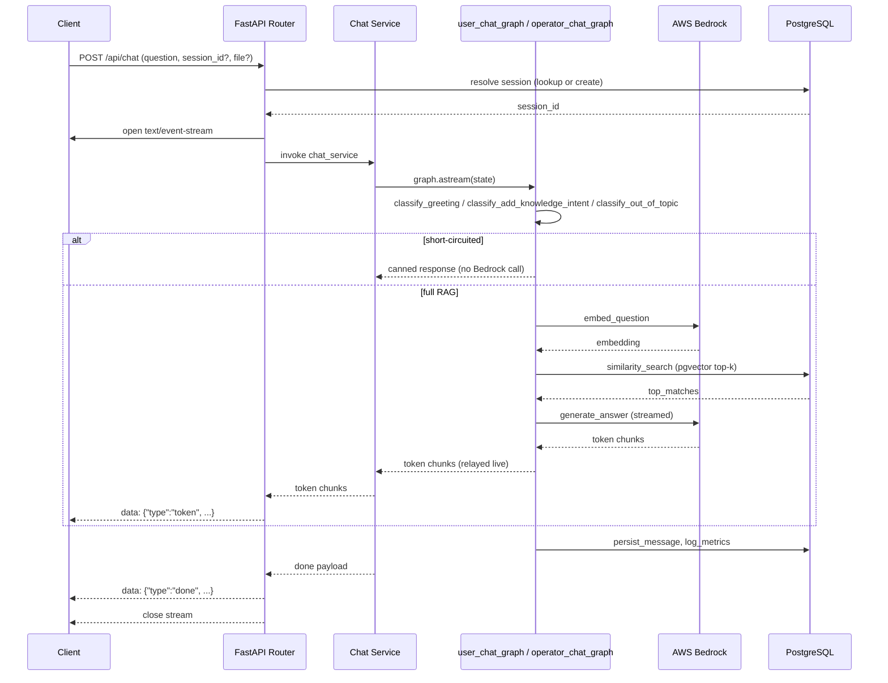
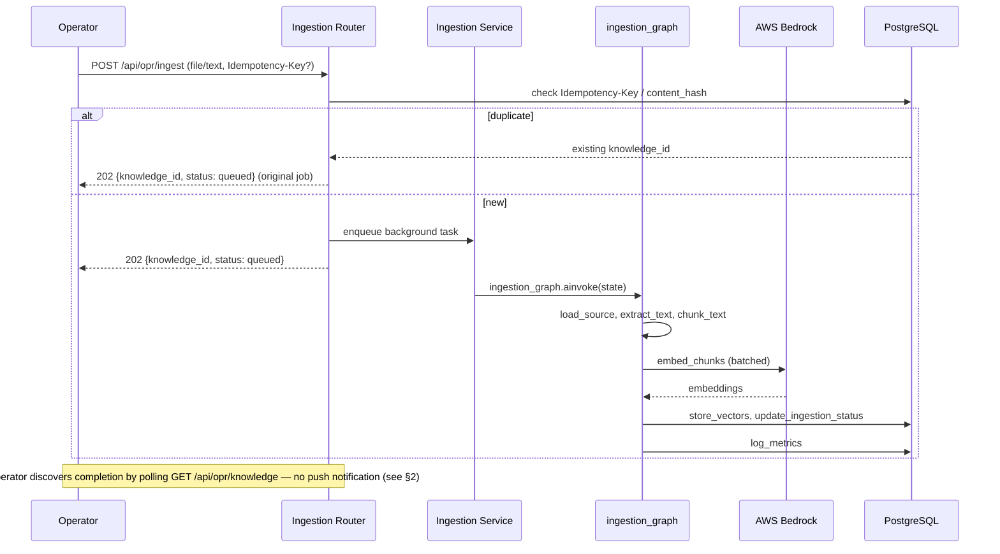

# 21 — Event Flow

## 1. Scope

Consolidated, cross-component event/message flow. Per-endpoint request-flow narratives already exist in `04-system-architecture.md` §4/§4a/§5, and per-graph node flow in `05-ai-agent-design.md` §2.2/§3.2 — this document does not restate those. Its two new contributions: (a) an explicit statement of what does **not** exist in this system (no message bus/pub-sub), so "event flow" isn't misread as implying asynchronous domain events; and (b) a single unified sequence-diagram view tying the scattered per-file narratives together visually.

## 2. No Event Bus / Message Broker (explicit clarification — new)

This system has **no** Kafka/SQS/pub-sub message broker, and no in-process domain-event-emitter pattern, in the current design. (`04-system-architecture.md` §6 notes that `/api/opr/ingest` could move from `BackgroundTasks` to Celery/RQ/Arq "if volume grows" — those would introduce a broker-backed task queue; if that happens, this section must be revisited, since it would no longer be strictly true. Not the case today.) Every interaction between components is one of exactly two kinds:

- **Synchronous request/response**: API → Service → Graph → Bedrock/DB, and back up the same call chain.
- **Shared state**, read/written directly: PostgreSQL (durable, source of truth for everything) or Redis (rate-limit counters only — `11-coding-standard.md` §13; nothing else is ever coordinated through Redis).

Concretely: `/api/opr/ingest`'s `queued`/`processing`/`completed`/`failed` status is discoverable only by the client **polling** `GET /api/opr/knowledge` — there is no webhook, callback, or WebSocket push notifying a client when an async ingestion job finishes (a reasonable candidate for a later phase, not built in Phase 1). This is written down explicitly so nobody designs a feature that assumes eventing infrastructure this system doesn't have.

## 3. Chat Request — Sequence Diagram (new visual artifact)

## 4. Ingestion Request — Sequence Diagram (new visual artifact)

## 5. Deletion Request

Cross-reference only, no new diagram: `04-system-architecture.md` §4a already gives a clean 4-step numbered flow for `DELETE /api/opr/knowledge/{id}` — a plain synchronous REST operation with no graph involvement, so a sequence diagram would add no information beyond what's already there.

## 6. Cross-Reference Index

| Detail | Where it's fully specified |
|---|---|
| Chat graph node-by-node logic | `05-ai-agent-design.md` §2.2/§2.3 |
| Ingestion graph node-by-node logic | `05-ai-agent-design.md` §3.2 |
| SSE wire format | `06-api-specification.md` §0 |
| Per-node latency logging shape | `09-observability.md` §4 |
| Per-node latency **targets** | `20-performance-target.md` §4 |
